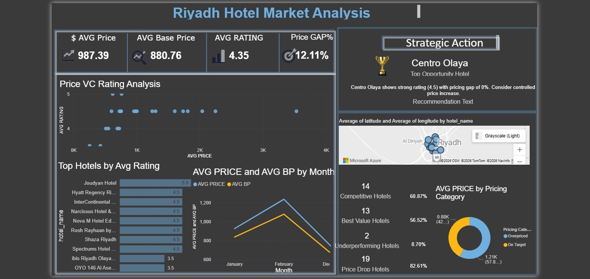

# 🏨 Riyadh Hotel Market Analysis

## 📌 Project Overview
This project analyzes hotel pricing, ratings, and market positioning in Riyadh using Power BI.

The dashboard was designed to support pricing strategy decisions and identify competitive, underperforming, and best-value hotels.

---

## 🛠 Tools Used
- Power BI
- Power Query
- DAX
- Excel

---

## 📊 Dashboard Features
- Price vs Rating Analysis
- Pricing Gap %
- Competitive Hotel Identification
- Best Value Hotel Detection
- Underperforming Hotel Analysis
- Strategic Recommendation Section
- Interactive KPI Dashboard
- Geographic Hotel Distribution using Maps

---

## 📈 Business Goals
- Analyze hotel pricing performance
- Compare market prices with hotel ratings
- Identify pricing opportunities
- Detect underperforming hotels
- Support strategic pricing decisions

---

## 🔍 Key Insights
- Some hotels showed high pricing despite average ratings
- Several hotels provided strong customer value
- Pricing gaps revealed opportunities for strategic adjustments
- Market segmentation helped identify competitive hotel groups

---

## 📷 Dashboard Preview

---

## 🚀 Future Improvements
- Add customer review sentiment analysis
- Include seasonal pricing trends
- Add forecasting for hotel pricing behavior
- Integrate booking and occupancy data

